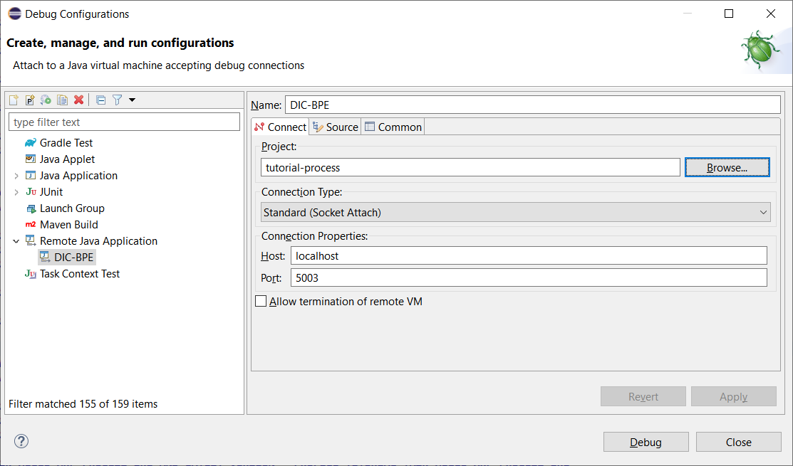

# Exercise 1.1 - Process Debugging
This exercise looks at how to use the Java debugger of your IDE to remote debug the execution of a process plugin.

## Introduction
The DSF FHIR server and the DSF BPE server applications are written in Java and as such are execute on a headless JRE 11. Command line arguments can be passed to the JVM inside the [ghcr.io/highmed/fhir](https://github.com/highmed/highmed-dsf/pkgs/container/fhir) and [ghcr.io/highmed/bpe](https://github.com/highmed/highmed-dsf/pkgs/container/bpe) docker images by specifying the environment variable `EXTRA_JVM_ARGS`. This can be used for example to configure the minimum and maximum heap of the JVM; but the environment variable can also be used to specify a remote debugging port, which we will use in this exercise.

An `EXTRA_JVM_ARGS` environment variable is configure for all DSF FHIR server and DSF BPE server docker containers in the tutorial docker test setup. Take a look at the [docker-compose.yml](https://github.com/highmed/dsf-process-tutorial/blob/main/test-setup/docker-compose.yml) file to lookup the port numbers specified for the different DSF FHIR and DSF BPE servers.

## Exercise Tasks
1. Start the DSF FHIR server for the `Test_DIC` organization in a console at location `.../dsf-process-tutorial/test-setup`:
    ```
    docker-compose up dic-fhir
    ```
2. Start the DSF BPE server for the `Test_DIC` organization in another console at location `.../dsf-process-tutorial/test-setup`:
    ```
    docker-compose up dic-bpe
    ```
3. Configure your Java IDE for remote debugging
    * Eclipse:  
        
    * IntelliJ:  
        

4. Create a Debug breakpoint in first line of the `HelloDic` class `doExecute` method. 
5. Start your previously defined remote Java debugger.
6. Execute the `TutorialExampleStarter` class to start `highmed_helloDic` process.
7. User your Java IDE debugger to step thru the code of the `HelloDic` class.